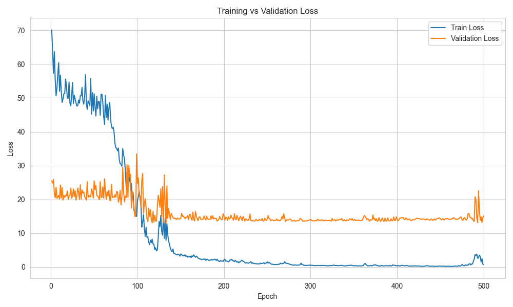
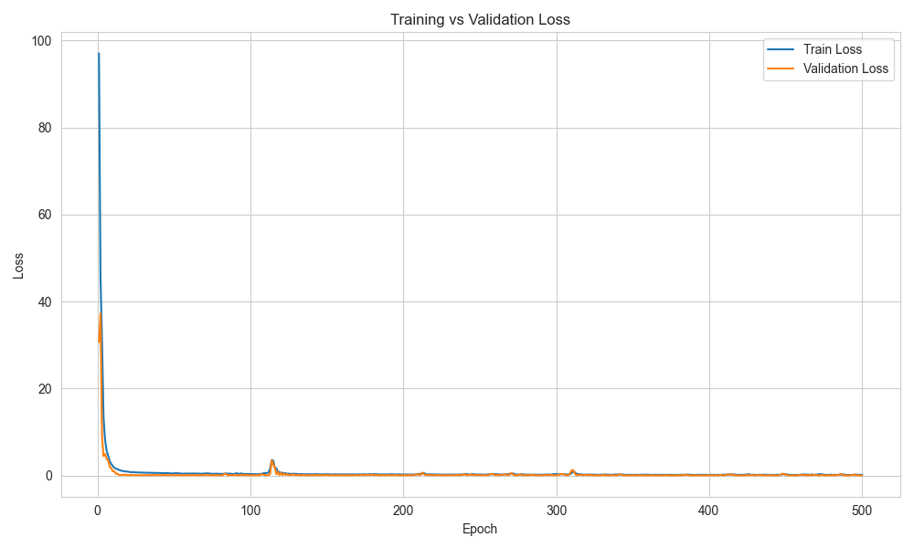

# Tubi Recommendation System Project

For tubi's builder program interview process, I decide to challenge myself to build a recommendation system for Tubi's movies in a week. Here are my design choices, design and thoughts on this project. Enjoy.

## Demo quickstart

I used [uv](https://docs.astral.sh/uv/) for python project manager to handle dependencies, environment and scripting. To install the dependcies from the `pyproject.toml` run:
```bash
uv sync
```

To run the intrinsic evaluator/content encoder training:
```bash
uv run -m src.train_intrinsic
```

To run the user encoder and extrinsic evaluator training:
```bash
uv run -m src.train_extrinsic
```

To run the recommendation infernece:
```bash
uv run -m src.recommend
```

## Dataset

### Content
Kaggle [dataset](https://www.kaggle.com/datasets/muhammadanasmahmood/tubi-movies-dataset/data) for Tubi movies and series.

Metrics, such as average user score, original language, populartity etc.,  came from searching [TMDB API](https://developer.themoviedb.org/docs/getting-started).

### User
Synthetic dataset using randomization and simulation from content data, since I couldn't find a publically avaliable one for Tubi. This is also helps mitigate a bit of the cold start issue.

#### Note
Some of the data is missing and I've tried my best to fill these NaN values with values that wouldn't affect the overall training of things, such as 0s and means. Furthermore the dataset I've used is quite small and I'm afraid this model will most likely lean towards overfitting to this small dataset. I've tried my best to mitigate this issue by using a train-val-test data split of (0.8, 0.1, 0.1).

## Model Architecture

Two-stage training with two towers system.

The intrinsic evaluator (for objective scores about each media, such as average user ratings, number of user ratings, etc.) trains a content encoder by passing the content encoder embeddings through a MLP that is trained to predict popularity. This predicted popularity score is then compared to the actual raw data popularity scores using Mean Square Error Loss (MSE Loss) and backpropogated based on this loss function.

The extrinsic evaluator (for user related data) trains the user encoder and outputs a user embedding, which is later used in the inference two towers system to calculate a recommendation score. In order to have a watch history for each user in the dataset, I had to first train the content encoder first and then use that content encoder to create the watch history content embeddings that are used to train the user encoder. The user encoder was trained using mean watch history embedded vectors as the ground truth and MSE loss.

The recommendation engine takes the dot product between al0l item_embeddings and the user embedding, and then find the top_k similarity scores to be used in a weighted recommendation score calculation. I personally used 0.7 for similarity scores and 0.3 for predicted popularity scores.

The trained model weights are stored in `./model/savepoints/`.

#### TODO:
Other architectures I've considered, but did not have time to implement for the 1-week challenge.

1. Use some kind of RNN that creates/modifies/updates the current user's latent watch state. Then use watch history to keep updating this watch state. Using this watch state, we can apply Approximate Nearest Neighbor (ANN) on a vector db of the media selection to find candidates. This might be clostly on a production level scale bc each user would need to maintain their own RNN weights. It may be viable if the number of RNN parameters is small enough.

2. expanding on this idea, we can have multiple versions of thes latent vectors to for different types of media (movie or tv etc.) or different types of genres

3. the demographics would be used for collaborative matching and filtering rather than as a part of the input vector data

4. If I can find a user dataset, then I might try to integrate collaborative based recommendation system and create a hybrid system.

## Findings
Here's the content/intrinsic evaluator tower training and validation loss.


Here's the user/extrinsic evaluator tower training and validation loss.



## Notes
For simplicity sake, I'm using MLPs since that's trainable/inferrable on my local computer without running out of resources.

## Reflection
Overall learned a lot about system design and different types of recommendation systems. Learned a lot about the different data signals that can be used for recommendation systems such as implicit/explicit data. Also found out more about collaborative (which I decided not to implement since it would be pretty inaccurate with my synthetic data) and content based approaches.

I think there was a lack of data to do anything substantial. Maybe I can find a better dataset. However, it was a good learning experience about recommendation systems.

